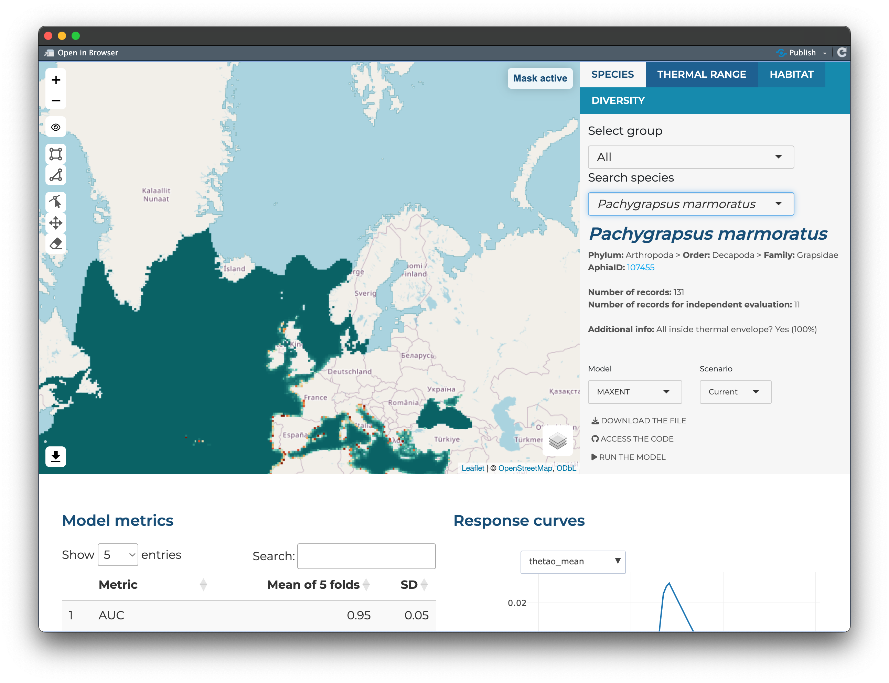

# MPA Europe maps platform

This is the repository for the maps platform being developed by [OBIS](https://obis.org) to hold the SDM (Species Distribution Models) maps produced as part of the [MPA Europe project](https://mpa-europe.eu/).

The platform uses [Quarto](https://quarto.org/) and [Shiny](https://shiny.posit.co/), and is still under development. You can access the platform here: (https://shiny.obis.org/distmaps/)

Below, a screenshot showing the most recent status:

## Repository structure

The main files are:

- *index.qmd*: Quarto file used to generate the webpage and the frontend part of the app (generate `index.html`).
- *_quarto.yml*: Quarto configuration file.
- *www/addons.js*: Javascript additional functions.
- *www/styles.css*: CSS stylesheet for personalization of the interface.

Main folders:

- *quarto_components*: Page sections.
- *components*: Shiny server-side components.
- *scripts*: R functions/scripts needed within components.

Components explanation:

- *serverstart.R*: Information loaded on server start  
- *tabactions.R*: Tab control/actions  
- *tabcontexts.R*: Tab contextual information  
- *updateoptions.R*: Update selectize options  
- *selectinfo.R*: Main information from input  
- *contextualinfo.R*: Add/update contextual information  
- *dataloaders.R*: Load accessory data  
- *renders.R*: Contextual information renders  
- *maprenders.R*: Map render and placeholder  
- *mapreactive.R*: Main reactive for map change  
- *mapmask.R*: Control mask over map  
- *thermaldata.R*: Update map with thermal data  
- *diversitydata.R*: Update map with diversity data  
- *extrainfo.R*: Extra information section  
- *extrainfomaps.R*: Extra information popup - maps  
- *downloads.R*: Manage download requests  
