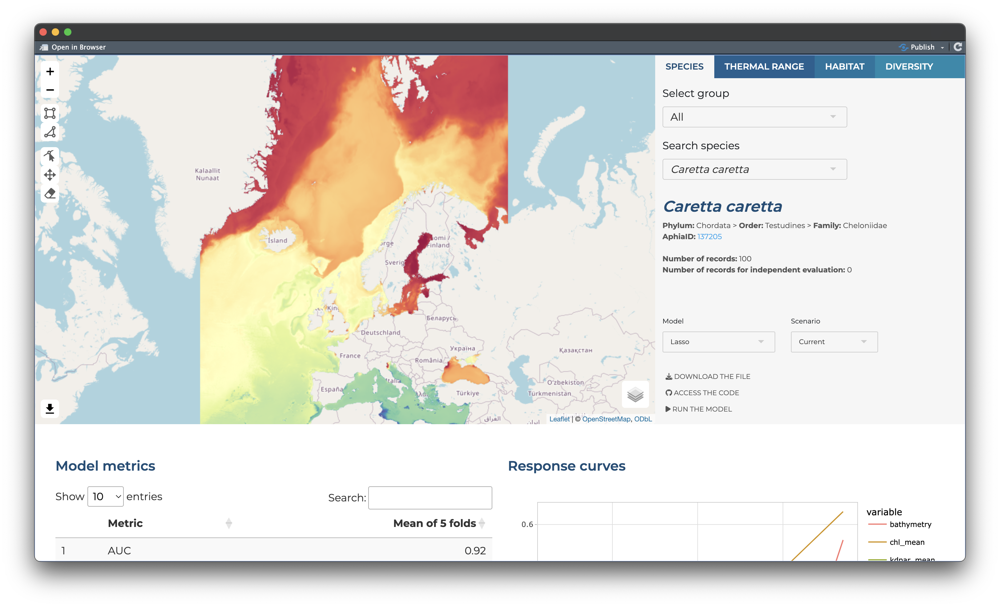

# MPA Europe maps platform

This is the repository for the maps platform being developed by [OBIS](https://obis.org) to hold the SDM (Species Distribution Models) maps produced as part of the [MPA Europe project](https://mpa-europe.eu/).

The platform uses [Quarto](https://quarto.org/) and [Shiny](https://shiny.posit.co/), and is still under development.

Below, a screenshot showing the most recent status:

## Repository structure

The main files are:

- *app.qmd*: Quarto file used to generate the webpage and the frontend part of the app.
- *sever.R*: Hold the functions on the server-side.
- *addons.js*: Javascript additional functions.
- *styles.css*: CSS stylesheet for personalization of the interface.

Main folders:

- *data*: Hold example data used to run the tests of the platform.
- *www*: Images used in the website.